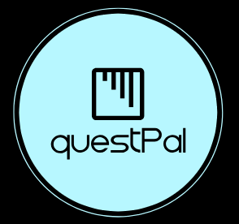

<h1 align="center"></h1>

A social media platform for developers to share interview questions from companies to prepare for their technical interviews

## Why QuestPal?
One common worry developers face during interview is answering the interview questions correctly. There is no better way of preparing for interview questions than knowing the questions that people were asked. QuestPal allows a developer community to share company name and the interview questions they were asked and search questions through company name or key word. It allows developers to better prepare for an interview.

## Key Features

### Search Questions

*	Two ways to search for questions
	* Select a question type (General, Algorithm, System Design) and input a keyword that might appear in a question
	* Select a company name from the company list

### Add Questions

* Multiple questions are allowed
	* Add question will allow user to add multiple questions for the company

## Built With

* [React](https://github.com/facebook/react) - Used for Front-end Single Page Application
* [React-Router](https://github.com/ReactTraining/react-router) - Route Management in a Single Page Application
* [Redux-Thunk](https://github.com/reduxjs/redux-thunk)- Handle Async request in redux
* [PostgreSQL](https://www.postgresql.org/)- Object-relational database system
* [Node](https://github.com/nodejs/node)- JavaScript runtime
* [Express](https://github.com/expressjs/express) - Web Framework for node.
* [Webpack](https://github.com/webpack/webpack) - Bundler for javascripts/React

##Authors

* **Phillip Troutman** - [https://github.com/troutman21](https://github.com/troutman21)
* **Robert Gonzalez** - [https://github.com/Paulg05](https://github.com/Paulg05)
* **Joseph Wu** - [https://github.com/josephwu1994](https://github.com/josephwu1994)

